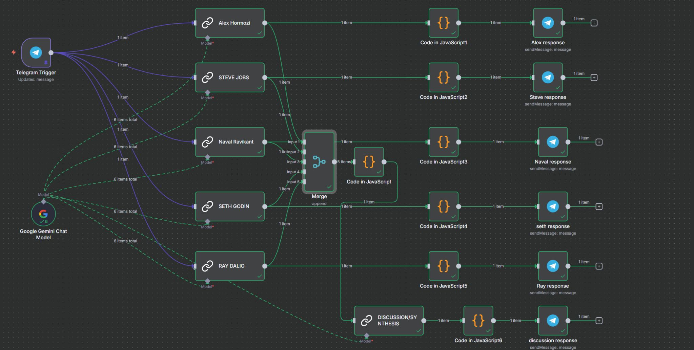

# Decision Synthesizer

## Overview

An AI-powered multi-perspective advisory system that eliminates analysis paralysis. Send it any business problem, decision, or idea. Five specialized AI personas simultaneously analyze your query from different domains, debate competing perspectives, and synthesize insights into clear, actionable decisions in seconds.

**The Problem:** Decision-making is hard. You get stuck between options, seek validation from echo chambers, and miss critical perspectives. You need diversity of thought, but you're limited by who's in your network.

**The Solution:** Get diverse expert perspectives simultaneously. Debate. Conflict. Synthesis. Clarity.

---

## How It Works
Your Question → 5 AI Personas Analyze Simultaneously → They Debate → Synthesis → Clear Decision

### Workflow Architecture

1. **Telegram Trigger** - Receive business questions/decisions via chat
2. **Google Gemini Chat Model** - LLM backbone for expert reasoning
3. **5 Specialized AI Personas** - Each analyzes from unique domain:
   - **Business Mechanics** - Revenue, operations, competitive advantage
   - **Design Thinking** - Simplification, core essence, user-centric approach
   - **Long-term Vision** - 10-year perspective, compound effects
   - **Narrative Reframing** - Story angle, emotional impact, context
   - **Systems Thinking** - Repeatable processes, scalability, frameworks
4. **Code Processing** - JavaScript transformations for response formatting
5. **Merge & Synthesize** - Combine perspectives and identify agreements/conflicts
6. **Discussion/Synthesis Node** - Create coherent, actionable recommendations
7. **Response Delivery** - Send synthesized advice back via Telegram

**Result:** Complex decision with multiple conflicting viewpoints → Structured advice in 30 seconds

---

## Technologies Used

- **n8n** - Workflow automation & orchestration
- **Google Gemini API** - Multi-turn LLM conversations
- **Telegram API** - Conversational interface
- **JavaScript** - Data transformation & logic
- **Parallel Processing** - Simultaneous persona reasoning

---

## Key Features

✅ **Multi-Perspective Analysis** - Get 5 viewpoints, not 1  
✅ **Intelligent Debate** - Personas disagree, surface real tensions  
✅ **Synthesized Output** - Conflicting perspectives → Actionable clarity  
✅ **Real-time** - Decisions in seconds, not hours  
✅ **Conversational** - Use Telegram as your thinking partner  
✅ **Production-Grade** - Parallel orchestration with proper error handling  

---

## Impact

**Before:** 
- Stuck analyzing options alone
- Seek opinions from 1-2 people
- Takes hours/days to decide
- Miss critical perspectives

**After:**
- 5 expert perspectives instantly
- Structured debate reveals tradeoffs
- Decision clarity in 30 seconds
- See full picture of agreements/conflicts

---

## Use Cases

- **Entrepreneurs** - Should I pivot? Hire? Launch?
- **Product Teams** - Which feature direction?
- **Investors** - Deal evaluation from multiple angles
- **Career Decisions** - Should I take this job? Start a company?
- **Strategic Planning** - What's our 5-year move?
- **Problem-Solving** - Complex issue analysis

---

## Technical Highlights

This project demonstrates advanced n8n capabilities:

- **Parallel AI Agent Orchestration** - Running 5 LLM calls simultaneously
- **Response Merging & Processing** - Combining diverse outputs intelligently
- **Prompt Engineering** - Persona-based reasoning with consistent formatting
- **Real-time Conversational Loop** - Telegram integration for interactive decisions
- **JavaScript Transformations** - Complex data processing between nodes
- **Production Architecture** - Scalable, error-handled automation system

---

## Workflow Explanation

The workflow image above shows:

1. **Left side (Input):** Telegram receives your question
2. **Middle (Processing):** Google Gemini model spawns 5 specialized personas
3. **Each persona:** Analyzes your query independently with JavaScript processing
4. **Right side (Synthesis):** Perspectives merge, get synthesized, and return via Telegram

**Implementation Details:** Specific prompts, persona definitions, synthesis logic, and response formatting are kept private but available for technical discussion.

---

## Why This Matters

Most people make decisions in isolation. This system forces you to see:
- Where experts agree (that's your truth)
- Where they conflict (that's the tradeoff)
- Why both perspectives might be right (context-dependent)

**Result:** Better decisions. Faster. With confidence.

---

## Questions?

This is one of my favorite projects - it combines n8n orchestration, LLM engineering, and practical problem-solving. Happy to discuss:
- How the personas are defined
- The synthesis algorithm
- Why parallel processing matters
- How to adapt this for other use cases

📧 hammam.alfarouq@gmail.com  
🔗 [LinkedIn](https://www.linkedin.com/in/hammam-khalaf)

---

## Related Projects

- [CV Extractor](https://github.com/HammamVR/CVExtractor-n8n) - Automated CV data processing

---

*Built with n8n | Powered by Gemini AI | Inspired by the need for clarity*
